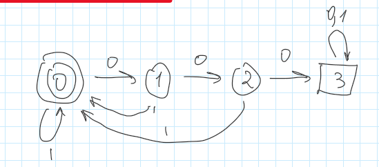
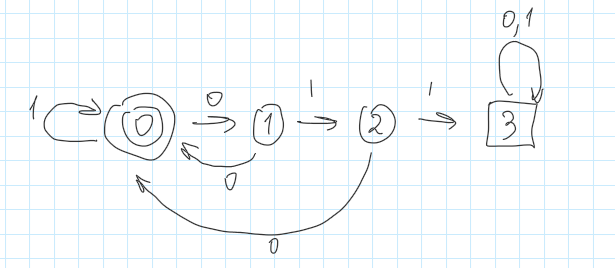
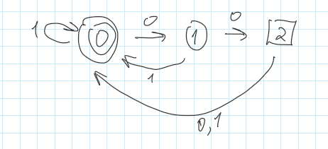
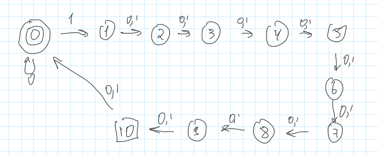
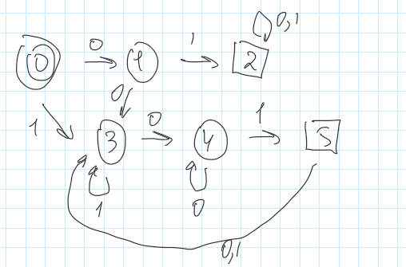
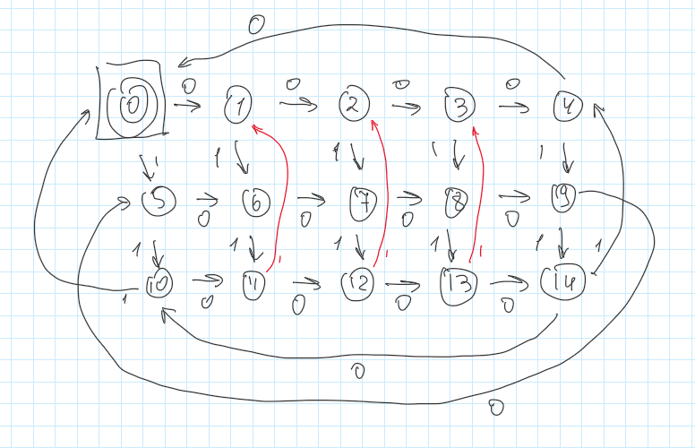

# Визуальное представление конечных автоматов

## №1
Строка содержит три нуля подряд

## №2
Строка содержит сочетание символов 011 идущих подряд

## №3
Слово кончается на 00

## №4
Слово содержит '1' на 10-ой позиции справа

## №5
Слово начинается или оканчивается (или и то и другое) на 01

## №6
Число нулей делится на 5, а число единиц делится на 3

## №9
Правильная скобочная последовательность.
Не существует конечного автомата, который распознавал бы правильные скобочные последовательности (факт упоминается в главе "Формальные грамматики").